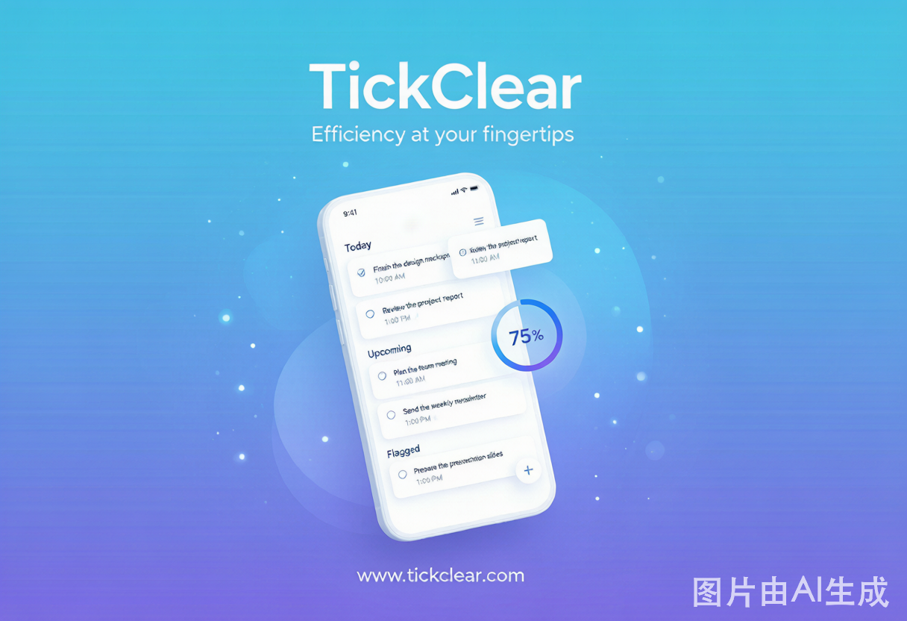
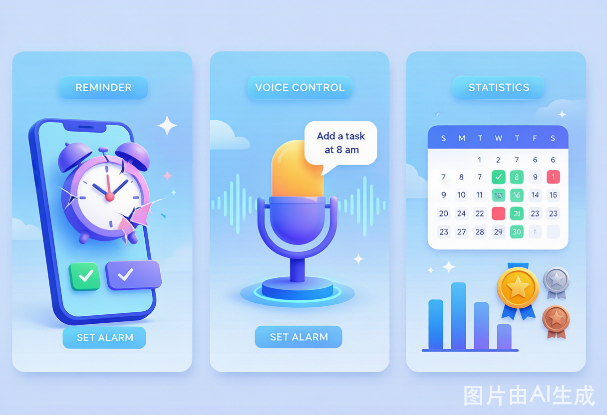
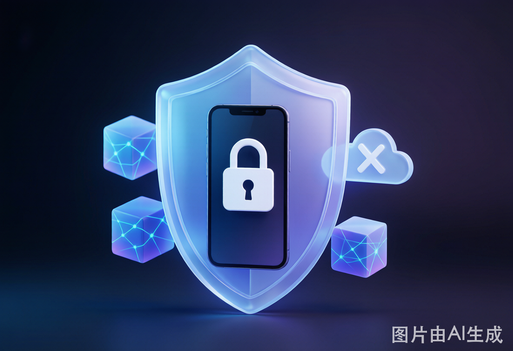

# 点清 TickClear · 推广宣传文案

> 本文档为 App 上架 / 社媒 / 应用商店推广物料集合，含核心标语、长短文案、卖点清单、应用商店描述与配图。所有文案基于 v2.5.2 实际功能撰写，不夸大未实现能力。

---

## 主视觉

> **管好每一个时间点，清空每一件烦心事。**

---

## 一、核心标语（Slogan）

**主标语**

> **管好每一个时间点，清空每一件烦心事。**

**备选短标语（社媒 / 应用图标副标题）**

- 纯本地 · 无账号 · 加密保存的任务清理神器
- 你的待办，不上云，只属于你
- 定时提醒 + 一键清空，今日事今日清
- 语音一句话，任务自动建

---

## 二、一句话简介（30 字内）

> 点清是一款纯本地、加密存储、无需账号的 Android 任务清理工具，用「任务组 + 定时提醒 + 一键清空」帮你今日事今日清。

---

## 三、应用商店长描述

**「点清 TickClear」—— 把待办清单，变成真正清空的爽感。**

你是否也有一长串永远清不完的待办？点清用最朴素的方式解决它：**分好组、定好点、到点提醒、一键清空。**

✨ **五大核心，一屏掌控**
- **今日**：分组展示今日任务，左滑软删（可撤销）、右滑完成，时间冲突自动角标提醒，完成率一环看清，「今日全部」一键清空。
- **任务**：全部任务与任务组增删改查，级联软删 + 回收站，误删 30 天内随时找回。
- **统计**：按组 / 日 / 周 / 月看完成率与连续打卡，8 枚勋章墙 + 热力图日历，坚持看得见。
- **助手**：接入小智语音助手，动动嘴就能建任务，默认离线可跑，不联网也能用。
- **设置**：浅色 / 深色 / 动态主题、语音与提醒精细配置，回收站与备份一站管理。

🔒 **隐私是底线，不是卖点**
所有数据经 **SQLCipher 加密**保存在你自己的手机里，**没有云端、没有账号、没有数据上传**。加密自动备份 + JSON 恢复 + ICS 日历互通，数据始终握在自己手中。

⏰ **提醒，精确到分**
精确闹钟 + 通知（完成 / 稍后 / 跳过），静音时段自动静默，全屏强提醒不错过重要事，还支持位置提醒（到地点才响）。

📱 **手机平板，一套体验**
手机底部 Tab、平板左导航双栏自适应，横屏 / 折叠 / 分屏无缝切换；桌面小组件、快捷方式、键盘快捷键，效率拉满。

**今日事，今日清。下载点清，从清空第一条待办开始。**

---

## 四、卖点清单（Bullet Points，商店特性栏）

- 🔒 纯本地存储 · SQLCipher 加密 · 无账号无云端
- 🗂️ 任务组管理 + 回收站（软删 30 天可恢复）
- ⏰ 精确闹钟提醒 + 静音时段 + 全屏强提醒
- 📍 位置提醒（地理围栏，到地点触发）
- 🎙️ 小智语音助手，一句话建任务，默认离线可用
- 📊 完成率 / 连续打卡 / 8 枚勋章 / 热力图日历
- 💾 加密自动备份 + JSON 恢复 + ICS 日历导入导出
- 📱 手机 / 平板 / 折叠屏自适应 + 桌面小组件
- 🌗 浅色 / 深色 / 动态取色主题
- ♿ TalkBack 无障碍 + 动态字体 + WCAG AA 对比度

---

## 五、社媒短文案（多平台）

**微博 / 朋友圈（140 字）**
> 待办清单永远清不完？试试「点清」——分好组、定好点、到点提醒、一键清空。纯本地加密存储，不上云不要账号，数据只在你手机里。语音一句话就能建任务，还能看连续打卡和勋章墙。今日事，今日清 ✅

**小红书标题**
> 我把待办 App 换成了它，终于体会到「清空」的爽感📱

**小红书正文**
> 用过一堆待办 App，不是要登录就是数据上云，总觉得不安心。
> 最近在用「点清 TickClear」，最戳我的三点：
> 1️⃣ 纯本地 + 加密：没有账号，数据全在自己手机，SQLCipher 加密存储🔒
> 2️⃣ 一键清空：今日任务分组显示，做完右滑，全清一键搞定，那种清空感真的解压
> 3️⃣ 语音建任务：对着小智助手说一句就建好了，还能离线用
> 打卡、勋章、热力图日历都有，坚持看得见～ #效率工具 #待办清单 #时间管理

**X / Twitter（英文）**
> Meet TickClear — a fully offline, encrypted to-do app for Android. No account, no cloud, no tracking. Group tasks, set precise reminders, and clear them all with one tap. Voice-create tasks even offline. Your data stays on your device. #Android #Productivity #Privacy

---

## 六、Google Play / 应用商店字段

- **应用名**：点清 TickClear
- **副标题**：本地加密 · 任务清理 · 定时提醒
- **分类**：效率 / 生产力
- **短描述（80 字）**：纯本地加密、无需账号的任务清理工具。任务组 + 定时提醒 + 一键清空，语音建任务离线可用，让你今日事今日清。
- **关键词**：待办清单, 任务管理, 定时提醒, 打卡, 本地加密, 隐私, 番茄钟, 时间管理, 语音助手, 日程

---

## 七、配图清单

| 图 | 文件 | 用途 | 状态 |
|----|------|------|------|
| 主视觉 Banner | `assets/promo_banner.png` | 商店头图 / 社媒封面 | ✅ 已生成 |
| 功能三宫格 | `assets/promo_features.png` | 商店特性图（提醒 / 语音 / 统计） | ✅ 已生成 |
| 隐私安全概念图 | `assets/promo_privacy.png` | 隐私卖点强化（本地加密 / 无云端） | ✅ 已生成 |

> 配图存放于 `docs/assets/`，为 AI 生成的品牌概念图（蓝紫科技风），可按需替换为实机截图。品牌主色延续应用主题（现代、简洁）。

---

## 八、文案使用须知

- 所有文案均基于 v2.5.2 已实现功能，**不得**添加未实现的能力宣传。
- 「离线可用」指助手默认 Mock 模式与本地能力；云端 ASR / LLM 需用户自行配置密钥。
- 「加密」指 SQLCipher 本地数据库加密与加密备份，非端到端传输加密（本 App 无云端传输）。
- 位置提醒、全屏提醒精度受设备厂商策略影响，宣传时可注明「支持」而非「保证」。
